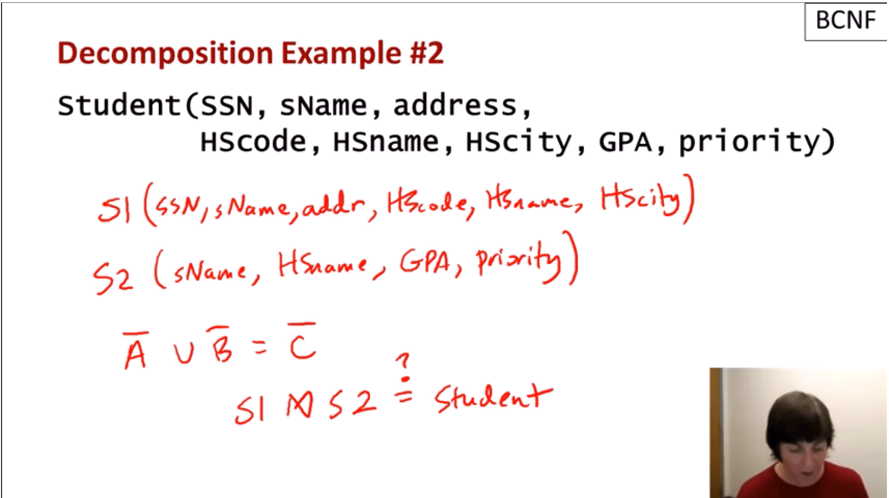

---?image=presentation/assets/image/petals.svg

## Data Cleansing with SQL and R

<a href="http://www.catallaxyservices.com">Kevin Feasel</a> (<a href="https://twitter.com/feaselkl">@feaselkl</a>)
<a href="http://csmore.info/on/cleansing">http://CSmore.info/on/cleansing</a>

---?image=presentation/assets/image/petals.svg

@title[Who Am I?]

@snap[west splitscreen]
<table>
	<tr>
		<td></td>
		<td><a href="https://csmore.info">Catallaxy Services</a></td>
	</tr>
	<tr>
		<td></td>
		<td><a href="https://curatedsql.com">Curated SQL</a></td>
	</tr>
	<tr>
		<td></td>
		<td><a href="https://wespeaklinux.com">We Speak Linux</a></td>
	</tr>
</table>
@snapend

@snap[east splitscreen]

	
	 
	<a href="http://www.twitter.com/feaselkl">@feaselkl</a>

@snapend

---?image=presentation/assets/background/2_0_cleaning.jpg&opacity=40

### Dirty Data

What is dirty data?

* Inconsistent data
* Invalid data
* Incomplete data
* Inaccurate data
* Duplicate data

+++?image=presentation/assets/background/2_1_philosophy.jpg&opacity=40

### Philosophy

The ideal solution is to clean data at the nearest possible point.  In rank order:
1. Before it gets into the OLTP system
2. Once it is in the OLTP system
3. ETL process to the warehouse
4. Once it is in the warehouse
5. During data analysis

Not all systems follow OLTP => DW => Analysis, so it is valuable to know multiple techniques for data cleansing.

+++?image=presentation/assets/background/2_2_motivation.jpg&opacity=40

### Motivation

Today's talk will focus on data cleansing within SQL Server and R, with an emphasis on R.  In SQL Server, we will focus on data structures.  In R, we will focus on the concept of tidy data.

This will necessarily be an incomplete survey of data cleansing techniques, but should serve as a starting point for further exploration.

We will not look at Data Quality Services or other data provenance tools in this talk, but these tools are important.

---?image=presentation/assets/image/petals.svg

@title[High-Level Concepts]

## Agenda
1. **High-Level Concepts**
2. SQL Server - Constraints
3. SQL Server - Mapping Tables
4. R - tidyr
5. R - dplyr
6. R - Data and Outlier Analysis

+++?image=presentation/assets/image/petals.svg

| Type | Sample Issues |
| ---- | :------------ |
| Consistency | Misspellings? Data stored in multiple places out of sync? |
| Validity | Physically or logically impossible answers? |
| Completeness | Missing values (represented with NULL, NA, etc.)? |
| Accuracy | Absurd-looking answers?  Multiple sources with conflicting results?  Suspicious sources? |
| Duplication | Can I tell if data is duplicated? |

+++?image=presentation/assets/background/3_6_rules.jpg&opacity=40

### Rules of Thumb

1. Impossible measurements (e.g., count of people over 500 years old) should go. Don't waste the space storing that.
2. "Missing" data (e.g., records with some NULL values) should stay, although might not be viable for all analyses.
3. Fixable bad data (e.g., misspellings, errors where intention is known) should be fixed and stay.
4. Unfixable bad data is a tougher call.  Could set to default, make a "best guess" change(!!), set to {NA, NULL, Unknown}, or drop from the analysis.

---?image=presentation/assets/image/petals.svg

@title[SQL Server - Constraints]

## Agenda
1. High-Level Concepts
2. **SQL Server - Constraints**
3. SQL Server - Mapping Tables
4. R - tidyr
5. R - dplyr
6. R - Data and Outlier Analysis

+++?image=presentation/assets/background/4_1_dataquality.jpg&opacity=40

### Keys and Constraints

Relational databases have several concepts to promote data quality:

* Normalization
* Data types
* Primary key constraints
* Unique key constraints
* Foreign key constraints
* Check constraints
* Default constraints

+++?image=presentation/assets/image/petals.svg

### Normalization

When in doubt, go with Boyce-Codd Normal Form.

**First Normal Form** - consistent shape + unique entities + atomic attributes

@div[left-50]
 

@divend

@div[right-50]

**Boyce-Codd Normal Form** - 1NF + all attributes fully dependent upon a candidate key + every determinant is a key.

@divend

+++?image=presentation/assets/background/4_3_datatypes.jpg&opacity=40

### Data Types

Think through your data type choices.

* Use the best data type (int/decimal for numeric, date/datetime/datetime2/time for date data, etc.)
* Use the smallest data type which solves the problem (Ex: date instead of datetime, varchar(10) instead of varchar(max))

+++?image=presentation/assets/background/4_4_constraints.jpg&opacity=40

### Constraints

Use constraints liberally.
* Primary key to describe the primary set of attributes which describes an entity.
* Unique keys to describe alternate sets of attributes which describe an entity.
* Foreign keys to describe how entities relate.
* Check constraints to explain valid domains for attributes and attribute combinations.
* Default constraints when there is a reasonable alternative to NULL.

+++?image=presentation/assets/background/4_5_demo.jpg&opacity=40

### Demo Time

---?image=presentation/assets/image/petals.svg

@title[SQL Server - Mapping Tables]

## Agenda
1. High-Level Concepts
2. SQL Server - Constraints
3. **SQL Server - Mapping Tables**
4. R - tidyr
5. R - dplyr
6. R - Data and Outlier Analysis